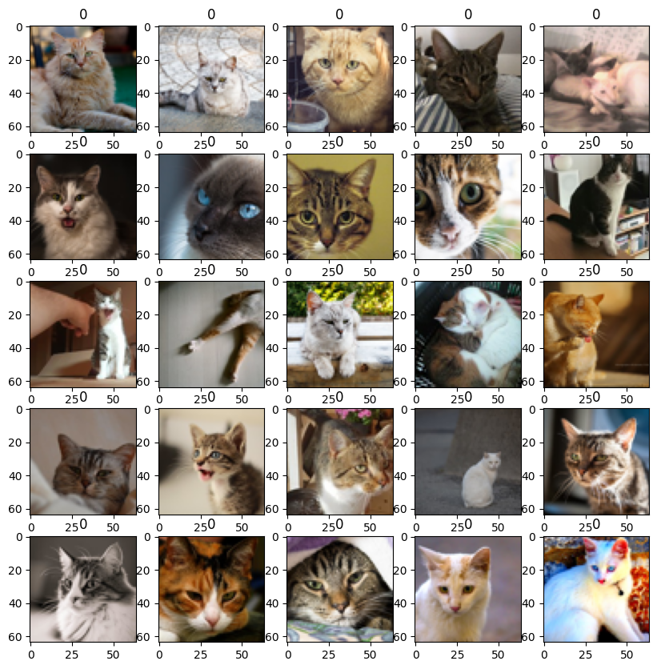
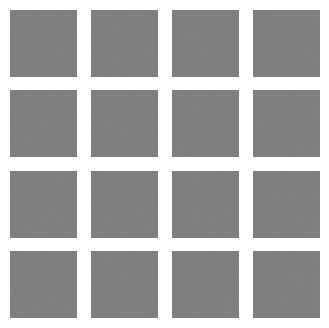
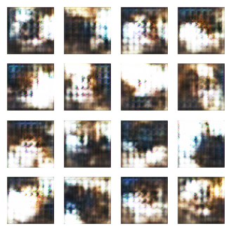
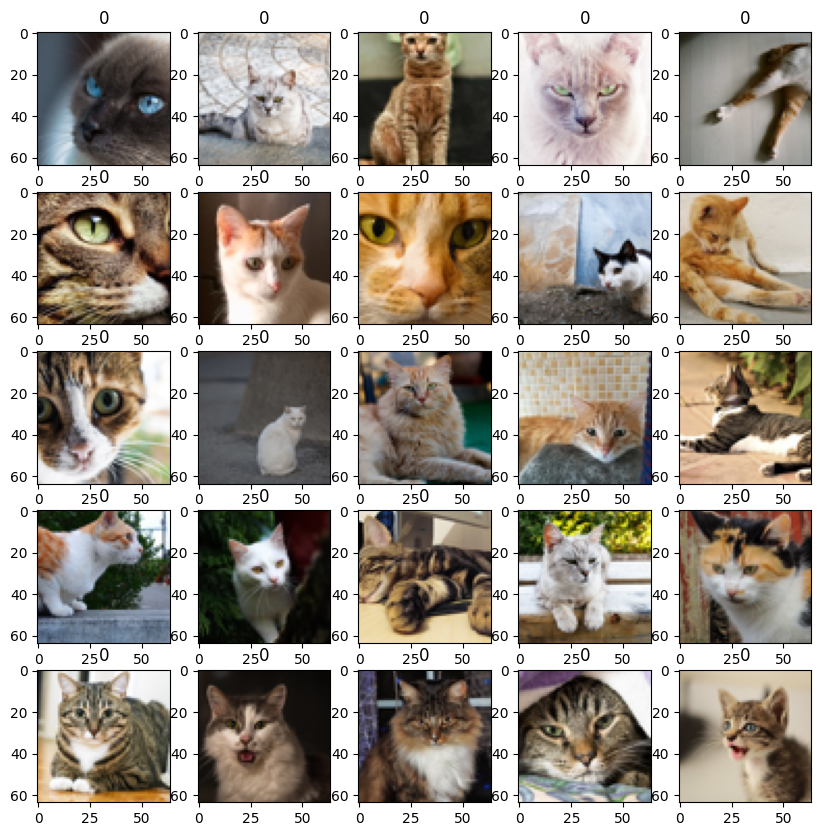
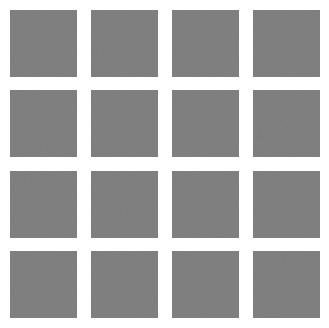
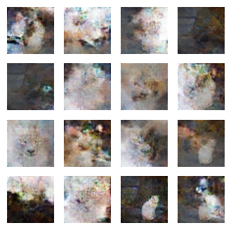
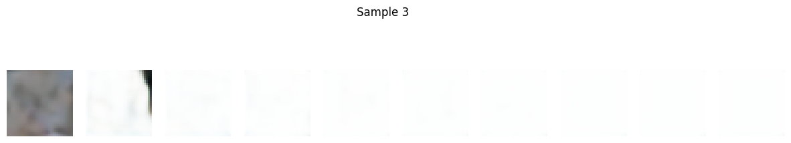

# GAN_DDIM_Cat_Generation
Flickr API 및 CIFAR-10 데이터셋을 활용한 고양이 이미지 크롤링 및 GAN, DDIM을 활용한 이미지 생성 프로젝트

# 이미지 생성 프로젝트 (GAN & DDIM)

## 📌 개요
이 프로젝트는 **Flickr API 및 CIFAR-10 데이터셋을 활용한 고양이 이미지 수집 및 생성 모델(GAN, DDIM) 실험**을 포함합니다. Generative Adversarial Networks (GAN)과 Denoising Diffusion Implicit Models (DDIM)을 활용하여 고양이 이미지를 학습하고 생성하는 과정을 다룹니다.

## 🛠️ 사용한 기술
- `Flickr API`를 이용한 이미지 크롤링
- `TensorFlow` 및 `Keras`를 활용한 GAN (생성자 및 판별자) 구현
- `DDIM`을 이용한 확산 모델 기반 이미지 생성
- `Matplotlib`을 활용한 결과 시각화
- Google Colab 환경에서 실행 가능

---

## 🔹 주요 실험 내용

### 1️⃣ GAN_cat_20240701_1.ipynb (첫 번째 GAN 실험)
- **Flickr API를 활용하여 고양이 사진 50장을 다운로드**
- **GAN(생성적 적대 신경망) 기반 이미지 생성**
- 생성된 이미지 출력 및 저장

#### ✔️ 실행 코드 예시 (GAN 생성자 모델)
```python
from tensorflow.keras.layers import Dense, Reshape, Flatten, Dropout, LeakyReLU, BatchNormalization, Conv2D, Conv2DTranspose
from tensorflow.keras.models import Sequential

def build_generator():
    model = Sequential()
    model.add(Dense(256*8*8, input_dim=100))
    model.add(LeakyReLU(alpha=0.2))
    model.add(Reshape((8, 8, 256)))
    model.add(Conv2DTranspose(128, kernel_size=4, strides=2, padding='same'))
    model.add(LeakyReLU(alpha=0.2))
    model.add(BatchNormalization())
    model.add(Conv2DTranspose(64, kernel_size=4, strides=2, padding='same'))
    model.add(LeakyReLU(alpha=0.2))
    model.add(BatchNormalization())
    model.add(Conv2DTranspose(3, kernel_size=4, strides=2, padding='same', activation='tanh'))
    return model
```

#### ✔️ 결과
- 고양이 이미지 생성 결과 (초기 실험 단계)
- , 

---

### 2️⃣ GAN_cat_20240701_2.ipynb (개선된 GAN 실험)
- 첫 번째 GAN 실험 결과를 바탕으로 **모델 성능 개선**
- 데이터셋을 확장하고, 이미지의 해상도를 최적화
- 생성된 고양이 이미지가 첫 번째보다 더 현실적으로 보임

#### ✔️ 실행 코드 예시 (GAN 판별자 모델)
```python
def build_discriminator():
    model = Sequential()
    model.add(Conv2D(64, kernel_size=4, strides=2, padding='same', input_shape=(64, 64, 3)))
    model.add(LeakyReLU(alpha=0.2))
    model.add(Dropout(0.3))
    model.add(Conv2D(128, kernel_size=4, strides=2, padding='same'))
    model.add(LeakyReLU(alpha=0.2))
    model.add(Dropout(0.3))
    model.add(Conv2D(256, kernel_size=4, strides=2, padding='same'))
    model.add(LeakyReLU(alpha=0.2))
    model.add(Dropout(0.3))
    model.add(Flatten())
    model.add(Dense(1, activation='sigmoid'))
    return model
```

#### ✔️ 결과
- 고양이 이미지 생성 결과 (향상된 품질)
- , 

---

### 3️⃣ Denoising Diffusion Implicit Models (DDIM).ipynb
- **DDIM을 활용한 고양이 이미지 생성 실험**
- CIFAR-10 데이터셋에서 고양이 이미지를 필터링하여 학습 진행
- 점진적인 노이즈 제거 기법을 통해 고양이 이미지 생성

#### ✔️ 실행 코드 예시 (U-Net 기반 DDIM 모델)
```python
def build_unet(input_shape):
    inputs = tf.keras.layers.Input(shape=input_shape)
    c1 = tf.keras.layers.Conv2D(64, (3, 3), activation='relu', padding='same')(inputs)
    p1 = tf.keras.layers.MaxPooling2D((2, 2))(c1)
    c2 = tf.keras.layers.Conv2D(128, (3, 3), activation='relu', padding='same')(p1)
    p2 = tf.keras.layers.MaxPooling2D((2, 2))(c2)
    b = tf.keras.layers.Conv2D(256, (3, 3), activation='relu', padding='same')(p2)
    u1 = tf.keras.layers.UpSampling2D((2, 2))(b)
    c3 = tf.keras.layers.Conv2D(128, (3, 3), activation='relu', padding='same')(u1)
    u2 = tf.keras.layers.UpSampling2D((2, 2))(c3)
    c4 = tf.keras.layers.Conv2D(64, (3, 3), activation='relu', padding='same')(u2)
    outputs = tf.keras.layers.Conv2D(3, (1, 1), activation='tanh')(c4)
    model = tf.keras.models.Model(inputs, outputs)
    return model
```

#### ✔️ 결과
- DDIM을 활용한 고양이 이미지 생성 결과
- , , 
